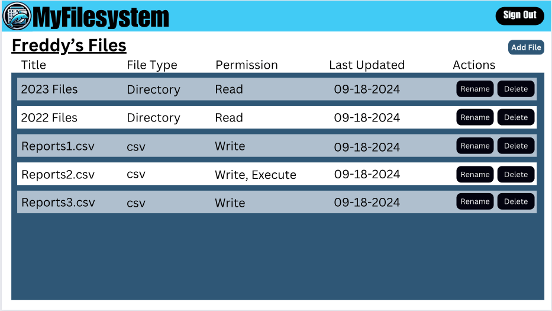
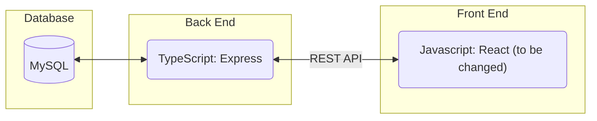
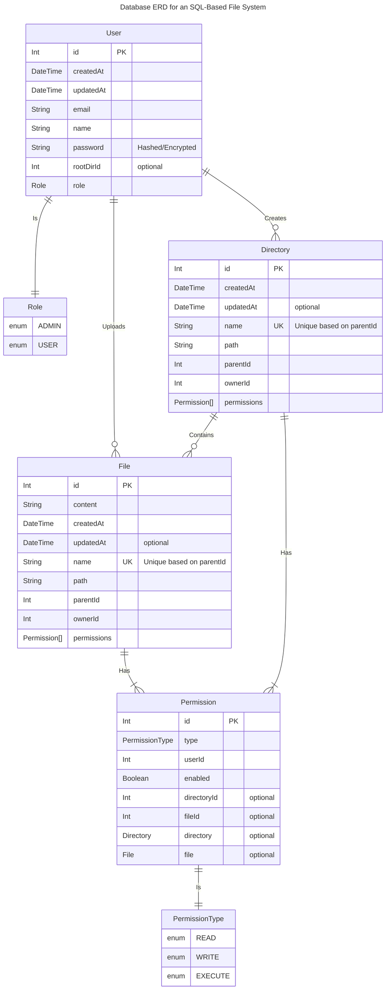
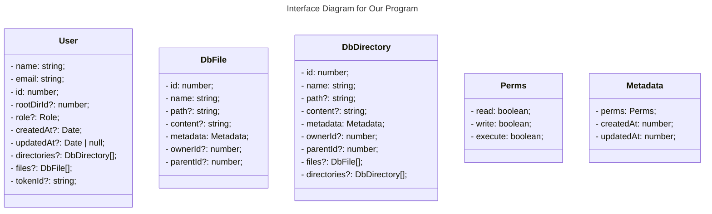
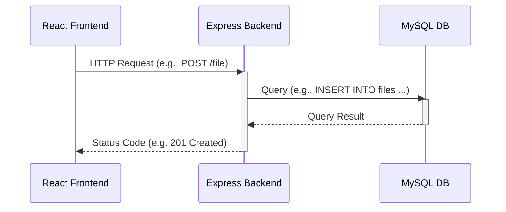

# Requirements and Specification Document

## Team Name

MyFilesystem

## Project Abstract


This project will implement a MySQL-based filesystem that will allow users to manage their files like they would in the file system in a typical operating system. Using React, Express, and Prisma with MySQL as the underlying storage layer, it will provide a web interface for users to create, read, update and delete files, directories or subdirectories. They will be able to view any associated file metadata (e.g. permissions, file type, last updated). Users will be required to log in and will only be able to view/update files that they have the required permissions for. Additionally, using the web interface, users will be able to visualize all directories and files in the file system in a tree structure.

## Customer

<!--A brief description of the customer for this software, both in general (the population who might eventually use such a system) and specifically for this document (the customer(s) who informed this document). Every project will have a customer from the CS506 instructional staff. Requirements should not be derived simply from discussion among team members. Ideally your customer should not only talk to you about requirements but also be excited later in the semester to use the system.-->
The customers for this software are the CS506 instructional staff and people needing/desiring a web based file system.

### User Requirements

<!--This section lists the behavior that the users see. This information needs to be presented in a logical, organized fashion. It is most helpful if this section is organized in outline form: a bullet list of major topics (e.g., one for each kind of user, or each major piece of system functionality) each with some number of subtopics.-->


| ID   | Description                                                  | Priority | Status |
| ---- | ------------------------------------------------------------ | -------- | ------ |
| [**R01**](#111)  | The system will provide a login page for users to access their account using a username and password. |   high   | Done   |
| [**R02**](#112)  | The system will provide an interface to users for editing the contents of a file they have write permission for (add and delete text). |   low   | Done   |
| [**R03**](#113)  |  The system will create a root directory for a new User when they first signup   | high | Done   |
| [**R04**](#114)  |  The system will permit users READ/WRITE/EXECUTE permissions for the root directory when the user first signup |  high   | Done   |
| [**R05**](#115)  |  The system will permit users to create new files and directories within directories they have write permissions to. |  high  | Open   |
| [**R06**](#116)  |  The system will permit users to delete files and directories that they have write permissions for. |  high   | Done   |
| [**R07**](#117)  |  The sytem will provide an interface for users to rename files and directories that they have write access to. |  medium     | Done   |
| [**R08**](#118)  | The system will display the contents of a file that a user has read permissions to when the name of that file is clicked on in the "tree-display" page. |   high   | Done   |
| [**R09**](#119)  | The system will provide an interface for users to log out of an account, terminating their authenticated session. |   high   | Done   |
| [**R10**](#120)  | The system will not allow any user to read files they don't have read permission for, write to file they don't have write permission for, or read, write, or view any file metadata that is contained within a directory that the user doesn't have read permission for.|  high    | Open   |
| [**R11**](#121)  | The system will permit permisisons update when User has WRITE permission on the directory or file |   low   | Done   |
| [**R12**](#122)  | The system will display metadata--read, write, and execute permissions, time when the file was created, and time the file was last updated--about all files and directories that are within directories that a user has read access to. |   medium   | Done   |
| [**R13**](#124)  | The system must be able to meet the designated speed and capacity performance requirements  |   high   | Done   |
| [**R14**](#125)  | The system will be able to handle file uploads for both empty and non-empty files. |  medium    | Done   |
| [**R15**](#126)  | The system must securely store sensitive information, including but not limited to, the names of the users, user passwords, file contents and metadata, and application secrets. |   high   | Done   |
| [**R16**](#127)  | The system will provide an interface for deletion of user accounts that displays a button to each user that allows them to delete only their account. |   medium   | Done   |
| [**R17**](#128)  | Documentation about how the system is designed by shall be contained in the README.md file stored on GitLab.  |  high    | Done   |
| [**R18**](#146)  | The system will provide a signup page for users to create an account. No user with the same email can be used to create an account more than once. The system asks the user to input password twice.  |  high    | Done   |


### User Stories

<!--Use cases and user stories that support the user requirements in the previous section. The use cases should be based off user stories. Every major scenario should be represented by a use case, and every use case should say something not already illustrated by the other use cases. Diagrams (such as sequence charts) are encouraged. Ask the customer what are the most important use cases to implement by the deadline. You can have a total ordering, or mark use cases with “must have,” “useful,” or “optional.” For each use case you may list one or more concrete acceptance tests (concrete scenarios that the customer will try to see if the use case is implemented).-->


##### File Creation

(U01)
> To add a file, I press the “add” button and the file creation dialog appears

(U02)
> I select a file from file creation dialog, and I am prompted to select the file

(U03)
> To finish the creation, I press the "open" button on the file creation dialog

(U04)
> To cancel the creation, I press the “cancel” button

##### File Deletion

(U05)
> To delete a file or directory, I select the delete button within the file or directory row

##### File Reading
(U06)
> To open a file, I click on the file name and the contents of that file are displayed on the screen.

(U07)
> Once file is open, to edit the file's contents I hit the edit button and can now make basic edits to the file's contents.

(U08)
> If the file can not be displayed/opened, the system will display an error message.

(U09)
> To go back to the tree display of the current directory I click the "Back" button. 

##### File and Directory Metadata
(U10)
> File or directory metadata is displayed in the same row as the file or directory. Metadata includes, File name, File type, Permissions, Updated At, and Actions. 

##### Navigation

(U11)
> To change directories, I click on the name of the directory I want to go to. 

(U12)
> The directory tree will display the files and directories it contains beneath it in the tree.

##### Login

(U13)
> When the webpage is loaded, login page appears and I am prompted to enter a username and password

(U14)
> Once my username and password are entered, I then press the “login” button to login

(U15)
> If my login credentials are incorrect the system will display an error message and I will be prompted to enter the info again.

##### User Creation

(U16)
> To create a new user, I press “create new user” button on login page and the “Create New User” page is shown

(U17)
> On the “Create New User” page, I am prompted to enter a name, username, password, and to re-enter the password.

(U18)
> To complete user creation, I press the "sign up" button and I am logged into the service

(U19) 
> If the credentials I entered are not allowed, the system displays an error message.

##### File and Directory Renaming
(U20)
> To rename a file, I press the "rename file" button when the file is selected and am prompted with the "rename file" dialog

(U21)
> I enter the new file name into the entry box and press confirm to rename a file

(U22)
> To cancel file renaming, I press the cancel button in the "rename file" dialog

##### logout
(U23)
> To logout, I press the logout button on the homepage and am logged out.

(U24)
> I press the confirm button on the confirm logout dialog to logout or the cancel button to return to the homepage.

##### Project Documentation
(U25)
> To understand how the system works, I access the project README.md file 

##### Account Deletion
(U26)
> To delete my account, I press the menu in the top right corner and click on "delete account"

(U27)
> I am prompted with the confirm account deletion dialog

(U28)
> I press the confirm button on the account deletion dialog to delete my account or the cancel button to return

##### Permission Update
(U29)
> To update permission on a file or directory, I need to have WRITE permisison on that file or directory

(U30)
> I click "Permission" button, I can uncheck checkbox to disable permissions, such as READ, WRITE, or EXECTUE.

(U31)
> I click "Permission" button, I can check checkbox to disable permissions, such as READ, WRITE, or EXECTUE.

##### Permission View
(U32)
> To view permission on a file or directory, I click the "Permission" button. It shows the list of permissions that I am granted for this file.

### Use Cases

- User wants to add a file (U01 - U04)
- User wants to delete a file (U05)
- User wants to view the contents of a file (U06 - U09)
- User wants to view the metadata of a file or directory (U10)
- User wants to change the directory they are in or view what a directory holds (U11 - U12)
- User wants to login to a file system (U13 - U15)
- User wants to create a new account (U16 - U19)
- User wants to rename a file or directory (U20 - U22)
- User wants to logout (U23 - U24)
- User wants to delete their account (U26 - U28)
- User wants to change permissions of a file or directory (U29 - U31)
- User wants to view permissions of a file or directory (U32)

### User-Requirements Traceability
| Requirements  | User stories |
| ------------  | ------------ |
| [**R05**](#115)  | [U01-U04](#file-creation)  |
| [**R06**](#116) | [U05](#file-deletion)  |
| [**R08**](#118)  | [U06](#file-reading)  |
| [**R02**](#112)  | [U07-U09](#file-editing) |
| [**R10**](#120) , [**R12**](#122)  | [U10](#file-metadata) |
| [**R03**](#113) , [**R08**](#118), [**R04**](#114) | [U11-U12](#navigation)  |
| [**R01**](#111) , | [U13-U15](#login)|
| [**R18**](#146) | [U16-U19](#user-creation)|
| [**R07**](#117)| [U20-U22](#file-renaming) |
| [**R09**](#119)   | [U23-U24](#logout) |
| [**R16**](#127)  | [U26-U28](#account-deletion) |
| [**R11**](#121)  | [U29-U31](#permission-update) |
| [**R12**](#122)  | [U32](#permission-view) |
| [**R15**](#126) | [Security](#security-requirements) |
| [R06](#user-requirements) | [Style](#user-interface-requirements) |
| [R09](#user-requirements) | [Permissions Class](#class-diagram) |
| [**R13**](#124) | [System Requirements](#system-requirements) |
| [**R14**](#125)  | [U23-U24](#file-import) |
| [**R17**](#128) | [U32](#project-documentation) |


### User Interface Requirements

<!--Describes any customer user interface requirements including graphical user interface requirements as well as data exchange format requirements. This also should include necessary reporting and other forms of human readable input and output. This should focus on how the feature or product and user interact to create the desired workflow. Describing your intended interface as “easy” or “intuitive” will get you nowhere unless it is accompanied by details.-->

<!--NOTE: Please include illustrations or screenshots of what your user interface would look like -- even if they’re rough -- and interleave it with your description.-->

- Login page
- User creation page
- Tree-like display of the file system
- Window to display file contents
- Top of screen navigation bar
- Dialogs to guide users through use cases as necessary
- File types are handled correctly
- Navigation changes display

**Style**



### Security Requirements

<!--Discuss what security requirements are necessary and why. Are there privacy or confidentiality issues? Is your system vulnerable to denial-of-service attacks?-->

- Only users having the permission to create/read/update/delete a file can do so
- User input (i.e. the modifications they make to the file system) is sanitized before storing files in the database
- User passwords are salted and hashed to comply with modern security standards
- Use HTTPS for secure communication
- Comprehensive logging to ensure the system is functioning as intended

### System Requirements

<!--List here all of the external entities, other than users, on which your system will depend. For example, if your system inter-operates with sendmail, or if you will depend on Apache for the web server, or if you must target both Unix and Windows, list those requirements here. List also memory requirements, performance/speed requirements, data capacity requirements, if applicable.-->

- Linux machine on which to run Docker
- 4 GB RAM
- Guaranteed p90 response times
    - LOGIN - 5 seconds
    - CREATE file/directory - 3 seconds
    - UPDATE file/directory - 3 seconds
    - DELETE file/directory - 3 seconds
    - READ tree view - 4 seconds
    - READ individual file view - 3 seconds
- Supports 100+ separate filesystems with 100 files with a filesize of 1MB on average

## Specification

<!--A detailed specification of the system. UML, or other diagrams, such as finite automata, or other appropriate specification formalisms, are encouraged over natural language.-->

<!--Include sections, for example, illustrating the database architecture (with, for example, an ERD).-->

<!--Included below are some sample diagrams, including some example tech stack diagrams.-->

<!-- You can make headings at different levels by writing `# Heading` with the number of `#` corresponding to the heading level (e.g. `## h2`). -->

#### Technology Stack





#### Database
[Mermaid ER Diagram Notaton Documentation](https://mermaid.js.org/syntax/entityRelationshipDiagram.html)


#### Interface Diagram




#### Flowchart


#### Sequence Diagram



# Code Standards

This document outlined the code standard for writing our project: MySQL-based Filesystem. The project uses JavaScript and React.js on the frontend and Typescript with Express.js and Prisma on the backend. 

### Naming Conventions

- **Components:** Use PascalCase for React components and hooks. For example, `<UserProfile />` in `UserProfile.js`.
- **Classes:** Use PascalCase. For example, `SomeKlass`.
- **Files:** Use camelCase for all files that do not export React components. For example, `userProfileHelpers.js`.
- **Methods & Variables:** Use camelCase for methods and variables. For instance, `getUserData`.
- **Constants:** Use all uppercase and separate words by underscore. For example, `SOME_CONSTANT`.

## Frontend standards

[Structure](#structure)

[State Management](#state-management)

[Styling](#styling)

### Structure
- src/
    - components/: reusable components without state.
        - sample/: page directory 
            - sample.js: actual component 
            - sample.test.js: test file for the component
        - index.js: file for exporting all components
    - containers/: a single use container with states that possibly contain multiple components.
    - pages/: a single page.
        - sample/: page directory 
            - sample.js: actual page view
            - sample.test.js: test file for the page
    - utils/: helper functions and constants.
        - constans/: contains directory
        - helper/: helper function directory
    - api/: API calls.
    - stores/: Global state store using Redux
    - assets/: Static assets like images and icons.

### State Management

- Prefer local state management with hooks (`useState`, `useReducer`) for simple state logic.
- Use context (`useContext`) for global state management or when passing props deeply.
- Use Redux for complex applications.

### Styling
- Use React Bootstrap to keep project styling consistent.
- Keep styling props minimal and use class names for static style.
- Use [prettier](https://prettier.io/) for automatic code formatting

### Testing
- Write unit tests for components using React Testing Library and Vitest.
- Test both the UI and interaction logic.
- Each file will have associated unit test files
- GUI will be tested manually to ensure correct functionality and desired appearance

# Backend Standards

### Directory Structure
- `/database`
    - `/test` -> contains all database integration tests
    - `query.ts` -> contains all Prisma Queries
    - `sample.ts` -> contains example data for database tests
- `/middlewares` -> contains all Express middleware (e.g. user authentication middleware)
- `/routes` -> contains express routers that define available routes and delegate them to the appropriate controller
- `/controllers` -> contains all controllers, which serve as a layer to implement business logic between the routers and the database
- `/test` -> contains all Jest tests for the backend API
- `/utils` -> contains type definitions, environment variables, and helper functions


### Source File Structure
Files consist of the following, in order:

1. JSDoc with `@fileoverview`
2. Imports
3. The file’s implementation

### `@fileoverview` JSDoc
A file must have a @fileoverview JSDoc to provide a description of the file's content.

```
/**
 * @fileoverview Description of file
 */
```

### Styling
- Use [prettier](https://prettier.io/) for automatic code formatting

### Testing
- Test that the API returns the expected response and that everything we need is being pulled from the database using the Jest testing framework.
- Write at least one test for each database query
- Write at least one test for each API route
- Each file will have associated unit test files for automated Testing
