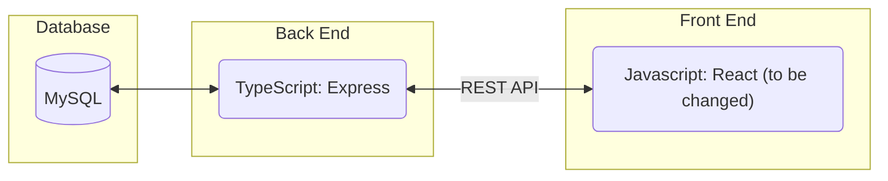
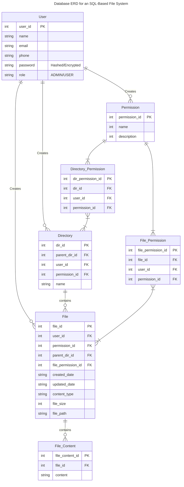
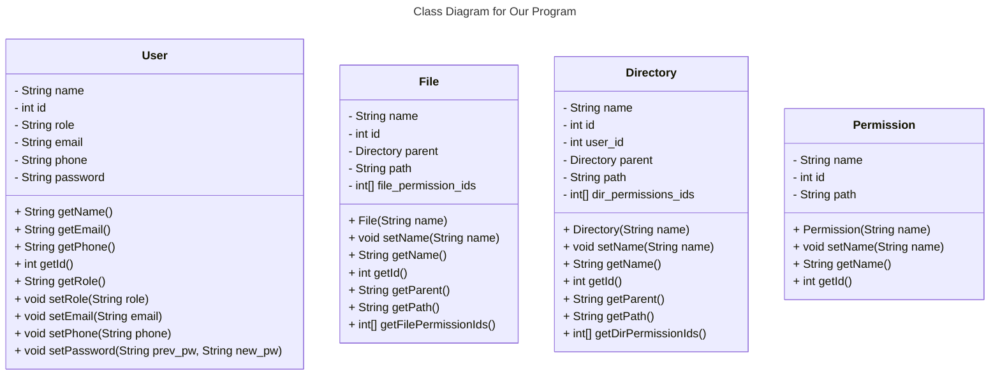
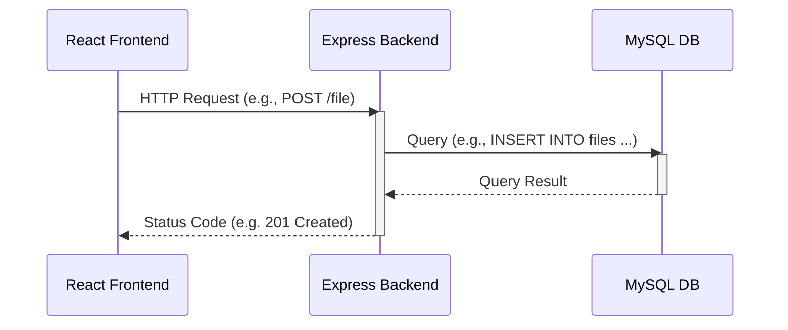

# Requirements and Specification Document

## Team Name

MyFilesystem

## Project Abstract


This project will implement a MySQL-based filesystem that will allow users to manage their files like they would in the file system in a typical operating system. Using React, Express, and Prisma with MySQL as the underlying storage layer, it will provide a web interface for users to create, read, update and delete files, directories or subdirectories. They will be able to view any associated file metadata (e.g. permissions, size, last updated). Users will be required to log in and will only be ablet o view/update files that they have the required permissions for. Additionally, using the web interface, users will be able to visualize all directories and files in the file system in a tree structure.

## Customer

<!--A brief description of the customer for this software, both in general (the population who might eventually use such a system) and specifically for this document (the customer(s) who informed this document). Every project will have a customer from the CS506 instructional staff. Requirements should not be derived simply from discussion among team members. Ideally your customer should not only talk to you about requirements but also be excited later in the semester to use the system.-->
The customers for this software are the CS506 instructional staff and people needing/desiring a web based file system.

### User Requirements

<!--This section lists the behavior that the users see. This information needs to be presented in a logical, organized fashion. It is most helpful if this section is organized in outline form: a bullet list of major topics (e.g., one for each kind of user, or each major piece of system functionality) each with some number of subtopics.-->


| ID   | Description                                                  | Priority | Status |
| ---- | ------------------------------------------------------------ | -------- | ------ |
| R01  |  Users should be able to create new files and directories where desired. |    | Open   |
| R02  |  Users should be able to delete files and directories. |     | Open   |
| R03  | Users should be able to move files to new locations or directories. |      | Open   |
| R04  |  Users should be able to rename files and directories. |       | Open   |
| R05  | Users should have an account associated with the file system they are using.|      | Open   |
| R06  | There should be a GUI to display the files and how they are organized.|      | Open   |
| R07  | The user should be able to login to an account. |      | Open   |
| R08  | The user should be able to logout of an account. |      | Open   |
| R09  | Users and files associated to one account/file system should not be able to access other accounts/file systems|      | Open   |
| R10  | Users should be able to view the contents of a selected file. |      | Open   |
| R11  | Users should be able to make basic edits to the contents of a file. |      | Open   |
| R12  | Users should be able to view metadata about a selected file. |      | Open   |
| R13  | Users should be able to edit the metadata of a selected file.|      | Open   |
| R14  | System should be able to handle many different file systems and many files in each system. |      | Open   |
| R15  | Users should be able to share/export files or directories. |      | Open   |
| R16  | Users should be able to import a file from their local machine. |      | Open   |
| R17  | Users should be able to organize the files how they want |      | Open   |
| R18  | System should be able to sort the files if the user would like. |      | Open   |
| R19  | System should store sensitive information securely |      | Open   |
| R20  | Users should be able to rename their file system |      | Open   |
| R21  | Users should be able to delete their account. |      | Open   |
| R22  | Users should be able to restart their file system from scratch |      | Open   |

### User Stories

<!--Use cases and user stories that support the user requirements in the previous section. The use cases should be based off user stories. Every major scenario should be represented by a use case, and every use case should say something not already illustrated by the other use cases. Diagrams (such as sequence charts) are encouraged. Ask the customer what are the most important use cases to implement by the deadline. You can have a total ordering, or mark use cases with “must have,” “useful,” or “optional.” For each use case you may list one or more concrete acceptance tests (concrete scenarios that the customer will try to see if the use case is implemented).-->


##### File Creation

(U01)
> To add a file, I press the “add” button and the file creation dialog appears

(U02)
> I select file type from file creation dialog, and I am prompted to name the file

(U03)
> To finish the creation, I press “confirm” button

(U04)
> To cancel the creation, I press the “cancel” button

##### File Deletion

(U05)
> To delete a file or directory, I select the file or directory and press delete, file is moved to “recently deleted” directory

##### File Updating

(U06)
> To update a file, I select the file and right click, and am prompted with the update file options dialog

##### File Reading
(U07)
> To open a file, I double click on it or press the open button while it is selected and the contents of that file are displayed on the screen.

(U08)
> Once file is open, To edit the file's contents I hit the edit button and can now make basic edits to the file's contents.

(U09)
> If the file can not be displayed/opened, the system will display an error message.

##### File Metadata
(U10)
> To view the metadata of a file, I select it and right click to display the "options" dialog.

(U11)
> When the "options" dialog is open, I click the properties button and the "properties" dialog appears displaying the metadata of the file.

##### Navigation

(U12)
> To change directories, I double-click the directory that I want to move to in the directory tree, and the new directory is opened up and displayed

(U13)
> When a directory is selected or the arrow attached to it is clicked, the directory tree should display the files and directories it contains beneath it in the tree.

(U14)
> When a directory is selected and its contents are already displayed in the tree, the contents should no longer be displayed in the tree.

##### Login

(U15)
> When the webpage is loaded, login page appears and I am prompted to enter a username and password

(U16)
> Once my username and password are entered, I then press the “login” button to login

(U17)
> If my login credentials are incorrect the system will display an error message.

##### User Creation

(U18)
> To create a new user, I press “create new user” button on login page and the “Create New User” page is shown

(U19)
> On the “Create New User” page, I am prompted to enter a username, password, and to re-enter the password;

(U20)
> To complete user creation, I press the confirm button and I am logged into the service

(U21) 
> If the credentials I entered are not allowed, the system displays an error message.

##### File Export

(U22) 
> To export a file, I select the file and press the export button and the export file dialog appears.

##### File Import
(U23) 
> To import a file, I select the import button and the import file dialog is displayed.

(U24) 
>I drag the desired file into the window or search for it using the access file dialog and it is imported into the current directory.

### Use Cases

- User wants to add a file (U01 - U04)
- User wants to delete a file (U05)
- User wants to update a file (U06)
- User wants to view the contents of a file (U07 - U09)
- User wants to view the metadata of a file (U10, U11)
- User wants to change the directory they are in or view what a directory holds (U12 - U14)
- User wants to login to a file system (U15, U16)
- User wants to create a new account (U18-U21)
- User wants to export a file (U22)
- User wants to import a new file to the system (U23-U24)


### User Interface Requirements

<!--Describes any customer user interface requirements including graphical user interface requirements as well as data exchange format requirements. This also should include necessary reporting and other forms of human readable input and output. This should focus on how the feature or product and user interact to create the desired workflow. Describing your intended interface as “easy” or “intuitive” will get you nowhere unless it is accompanied by details.-->

<!--NOTE: Please include illustrations or screenshots of what your user interface would look like -- even if they’re rough -- and interleave it with your description.-->

- Login page
- User creation page
- Tree-like display of the file system
- Window to display file contents
- Top of screen navigation bar
- Dialogs to guide users through use cases as necessary
- File types are handled correctly
- Navigation changes display

### Security Requirements

<!--Discuss what security requirements are necessary and why. Are there privacy or confidentiality issues? Is your system vulnerable to denial-of-service attacks?-->

- Only users having the permission to create/read/update/delete a file can do so
- User input (i.e. the modifications they make to the file system) is sanitized before storing files in the database
- User passwords are salted and hashed to comply with modern security standards
- Use HTTPS for secure communication
- Comprehensive logging to ensure the system is functioning as intended

### System Requirements

<!--List here all of the external entities, other than users, on which your system will depend. For example, if your system inter-operates with sendmail, or if you will depend on Apache for the web server, or if you must target both Unix and Windows, list those requirements here. List also memory requirements, performance/speed requirements, data capacity requirements, if applicable.-->

- Linux machine on which to run Docker
- 4 GB RAM
- TODO <performance/speed_requirements (we need to decide how fast we want certain operations to be)
    - LOGIN
    - CREATE
    - READ
    - UPDATE
    - DELETE
    - LOAD tree view
- TODO <data_capacity_requirements> (depends on how many users we plan to support)

## Specification

<!--A detailed specification of the system. UML, or other diagrams, such as finite automata, or other appropriate specification formalisms, are encouraged over natural language.-->

<!--Include sections, for example, illustrating the database architecture (with, for example, an ERD).-->

<!--Included below are some sample diagrams, including some example tech stack diagrams.-->

<!-- You can make headings at different levels by writing `# Heading` with the number of `#` corresponding to the heading level (e.g. `## h2`). -->

#### Technology Stack





#### Database
[Mermaid ER Diagram Notaton Documentation](https://mermaid.js.org/syntax/entityRelationshipDiagram.html)


#### Class Diagram



<!-- 
classDiagram
    class Animal {
        - String name
        + Animal(String name)
        + void setName(String name)
        + String getName()
        + void makeSound()
    }
    class Dog {
        + Dog(String name)
        + void makeSound()
    }
    class Cat {
        + Cat(String name)
        + void makeSound()
    }
    class Bird {
        + Bird(String name)
        + void makeSound()
    }
    Animal <|-- Dog
    Animal <|-- Cat
    Animal <|-- Bird -->

#### Flowchart


#### Sequence Diagram



# Code Standards

This document outlined the code standard for writing our project: MySQL-based Filesystem. The project uses React.js as frontend and Typescript as backend. 

## React.js standards

[Project Structure](#project-structure)

[Naming Conventions](#naming-conventions)

[State Management](#state-management)

[Styling](#styling)

### Project Structure
- src/
    - components/: React components.
    - utils/: Utility functions and constants.
    - api/: API calls.
    - styles/: Global styles and themes.
    - assets/: Static assets like images and icons.

### Naming Conventions

- **Components:** Use PascalCase for React components. For example, `UserProfile.js`.
- **Files:** Use camelCase for other files. For example, `userProfileHelpers.js`.
- **Methods & Variables:** Use camelCase for methods and variables. For instance, `getUserData`.

### State Management

- Prefer local state management with hooks (`useState`, `useReducer`) for simple state logic.
- Use context (`useContext`) for global state management or when passing props deeply.
- Use Redux for complex applications.

### Styling
- Use React Bootstrap to keep project styling consistent.
- Keep styling props minimal and use class names for static style.

### Testing
- Write unit tests for components using React Testing Library.
- Test both the UI and interaction logic.
- Maintain above 80% coverage

# Typescript Standards

### Source File Structure
Files consist of the following, in order:

1. JSDoc with `@fileoverview`, if present
2. Imports, if present
3. The file’s implementation

### `@fileoverview` JSDoc
A file may have a @fileoverview JSDoc. It should provide a description of the file's content.

```
/**
 * @fileoverview Description of file
 */
```

### Naming Conventions
- **Classes:** Use UpperCamelCase. For example, `FirstProjectFile`.
- **Constants:** Use all uppercase and separate words by underscore. For example, `SOME_CONSTANT`.
- **Files:** Use camelCase for other files. For example, `userProfile.ts`.
- **Functions & Variables:** Use camelCase for functions and variables. For instance, `getUserData`.

### Testing
- Test that everything we need is being pulled from the database.
- Maintain above 80% coverage
